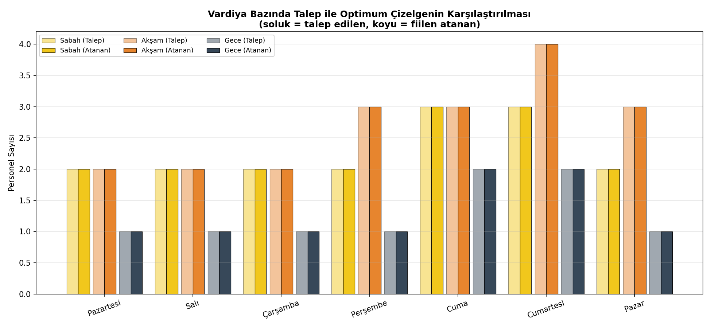
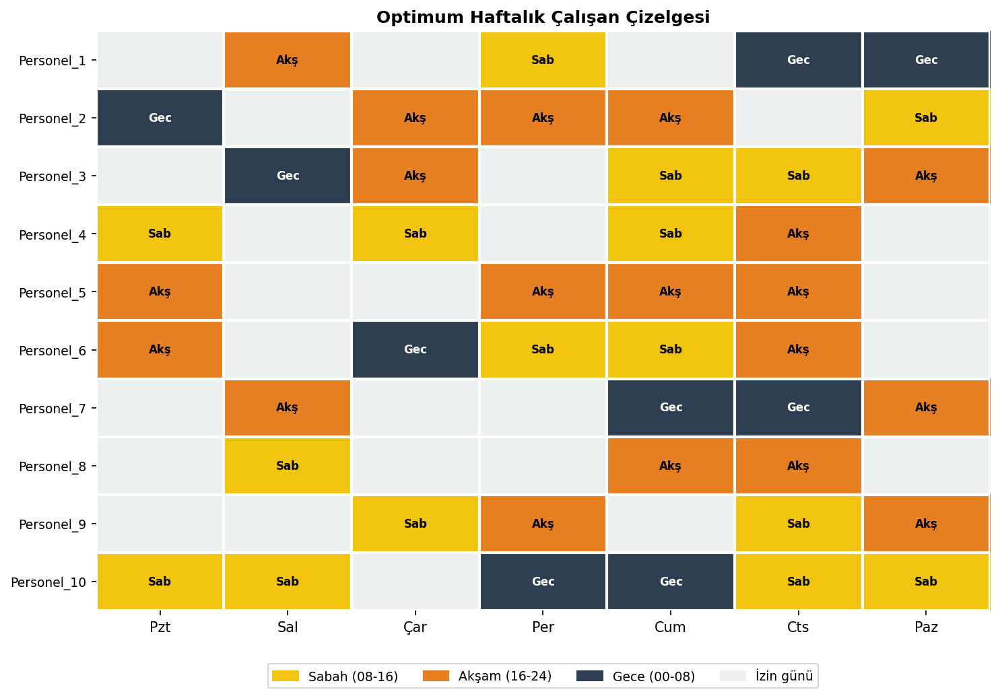
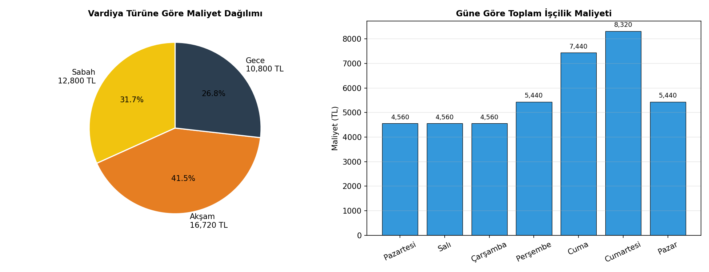

# vardiya-cizelgeleme-optimizasyonu

Tam sayılı programlama (scipy.optimize.milp / HiGHS) ile personel vardiya çizelgeleme - talep karşılama, 11 saat dinlenme kuralı ve adil dağıtım kısıtlarıyla maliyet minimizasyonu

## Açıklama

Bu proje, 7/24 açık bir mağaza/restoran örneği üzerinden **haftalık personel
vardiya çizelgeleme problemini** İkili (Binary) Tam Sayılı Programlama olarak
modelleyip çözer. Amaç, gün ve vardiya bazında değişen personel talebini
karşılarken, **İş Kanunu'na uygun dinlenme sürelerini** ve **adil iş
dağılımını** sağlayarak toplam işçilik maliyetini minimize etmektir.

Çözücü olarak harici kurulum gerektiren PuLP/CBC yerine, **SciPy'a gömülü
HiGHS çözücüsü** (`scipy.optimize.milp`) kullanılmıştır — bu sayede proje
yalnızca `numpy`, `scipy` ve `matplotlib` ile, ek bir MILP çözücü kurulumu
olmadan çalışır.

## Matematiksel Model

**Karar Değişkeni**

```
x[e,d,s] ∈ {0,1}   :  e çalışanı, d gününde, s vardiyasında çalışıyorsa 1
```

**Amaç Fonksiyonu**

```
minimize  Σ maliyet[s] · x[e,d,s]
```

**Kısıtlar**

| # | Kısıt | Açıklama |
|---|---|---|
| 1 | `Σₑ x[e,d,s] ≥ talep[d,s]` | Her gün-vardiya için talep karşılanmalı |
| 2 | `Σₛ x[e,d,s] ≤ 1` | Bir çalışan günde en fazla 1 vardiyada çalışabilir |
| 3 | `Σ_{d,s} x[e,d,s] ≤ 6` | Haftada en az 1 gün izin (İş Kanunu Md. 46 — hafta tatili) |
| 4 | `Σ_{d,s} x[e,d,s] ≥ 3` | Her çalışana haftalık minimum garanti vardiya sayısı |
| 5 | `x[e,d,s1] + x[e,d+1,s2] ≤ 1` | Vardiyalar arası minimum 11 saat dinlenme (İş Kanunu Md. 69) |

**Kısıt 5** somut olarak şu ardışık gün-vardiya kombinasyonlarını yasaklar
(dinlenme süresi 11 saatin altında kaldığı için):

- Akşam (16-24) → ertesi gün Sabah (08-16): **8 saat dinlenme** ❌
- Akşam (16-24) → ertesi gün Gece (00-08): **0 saat dinlenme** ❌
- Sabah (08-16) → ertesi gün Gece (00-08): **8 saat dinlenme** ❌

## Kurulum

```bash
git clone https://github.com/burakefearslanturk/vardiya-cizelgeleme-optimizasyonu.git
cd vardiya-cizelgeleme-optimizasyonu
pip install -r requirements.txt
```

## Kullanım

```bash
# Modeli çöz, tabloları yazdır, 3 görseli üret
python ana_program.py

# Sadece modeli çalıştırıp çizelgeyi konsolda görmek için
python vardiya_modeli.py
```

## Örnek Sonuç

```
OPTİMUM TOPLAM HAFTALIK İŞÇİLİK MALİYETİ: 40,320 TL

GÜN-VARDİYA BAZINDA TALEP KARŞILAMA
Pazartesi     Sabah: 2/2  Akşam: 2/2  Gece: 1/1
...
Cumartesi     Sabah: 3/3  Akşam: 4/4  Gece: 2/2
```

21 gün-vardiya kombinasyonunun **tamamında talep tam olarak karşılanmış**,
10 çalışan arasında **0 dinlenme kuralı ihlali** ile ve her çalışan
3-6 vardiya aralığında adil biçimde çalıştırılarak çözüme ulaşılmıştır.

## Görselleştirmeler

Program çalıştırıldığında proje kök dizinine (README.md ile aynı yere) üç grafik kaydedilir:

### 1) Talep vs Optimum Çizelge Karşılaştırması



Her gün-vardiya için talep edilen (soluk renk) ve modelin fiilen atadığı
(koyu renk) personel sayısı üst üste çizilir; çubukların tam örtüşmesi,
modelin talebi ne eksik ne fazla karşıladığını gösterir.

### 2) Optimum Çalışan Çizelgesi



10 çalışanın 7 günlük vardiya atamalarını gösteren ısı haritası. Boş
(gri) hücreler izin günlerini temsil eder; her çalışanın haftada en az
1 gün izinli olduğu görsel olarak doğrulanabilir.

### 3) Maliyet Dağılımı



Sol: toplam maliyetin vardiya türüne göre dağılımı (gece vardiyasının
zamlı ücreti nedeniyle orantısız payı dikkat çekicidir). Sağ: güne göre
toplam işçilik maliyeti — hafta sonu talebinin artmasıyla maliyetin de
yükseldiği görülür.

## Klasör Yapısı

```
vardiya-cizelgeleme-optimizasyonu/
├── veri.py                    # Gün/vardiya tanımları, talep matrisi, maliyetler, kısıt parametreleri
├── vardiya_modeli.py           # MILP modeli kurma ve scipy.optimize.milp ile çözme
├── gorsellestirme.py           # Talep-kapsama, çizelge ısı haritası, maliyet grafiği
├── ana_program.py              # Tüm modülleri çalıştıran ana script
├── talep_kapsama.png           # Üretilen görsel (README'de kullanılır)
├── calisan_cizelgesi.png       # Üretilen görsel (README'de kullanılır)
├── maliyet_dagilimi.png        # Üretilen görsel (README'de kullanılır)
├── requirements.txt
└── README.md
```

> Görseller ayrı bir alt klasörde DEĞİL, README.md ile aynı kök dizinde
> tutulur — bu sayede GitHub'a yüklerken klasör yapısı karışıklığı
> yaşanmaz ve `` gibi göreli bağlantılar
> sorunsuz çalışır.

## Kendi İşletmenizle Kullanım

`veri.py` dosyasındaki `TALEP` matrisini, `CALISAN_SAYISI`'nı ve
`VARDIYA_MALIYETI` sözlüğünü kendi işletmenizin verileriyle değiştirmeniz
yeterlidir. Model, çalışan sayısı talebi karşılamaya yetmiyorsa (infeasible)
bunu açıkça bildirir; bu durumda çalışan sayısını artırmanız veya
`MIN_HAFTALIK_VARDIYA` / `MAKS_HAFTALIK_VARDIYA` kısıtlarını gözden
geçirmeniz gerekir.

## Lisans

MIT
